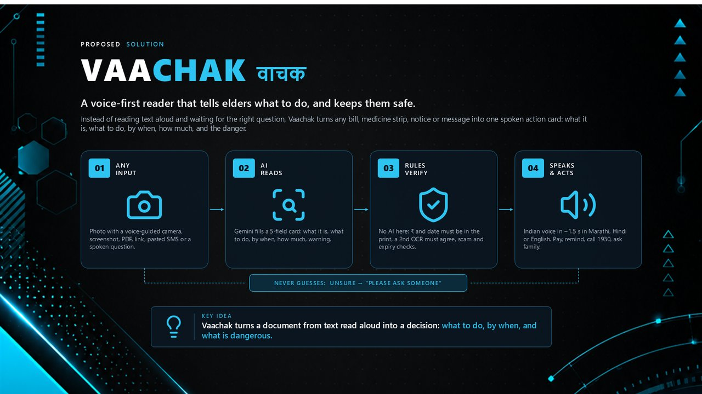
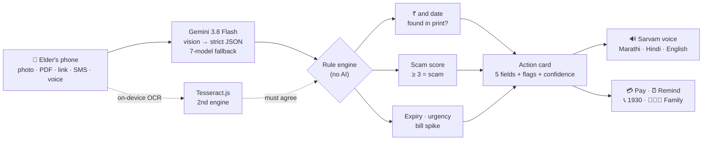
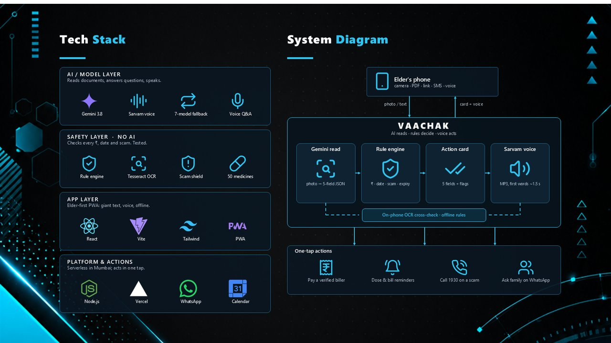

<div align="center">

# Vaachak · वाचक

### Reads any bill, medicine strip or message, and tells an elderly person, in their own language, exactly what to do.

**THINK AI 4.0 · IETE TCET Mumbai · PS 10: AI-Powered Accessibility Assistant · Team Vaachak**

[](https://vaachak-zeta.vercel.app)
[](https://vaachak-zeta.vercel.app/Vaachak-THINK-AI-4.0.pdf)
[](#testing)
[](#features)



</div>

> **Gemini answers questions. Vaachak never needs one.** An elderly person should not have to know what to ask. Vaachak gives the answer first: what this is, what to do, by when, how much, and what is dangerous.

---

## Contents

[The problem](#the-problem) · [What Vaachak does](#what-vaachak-does) · [Try it in 60 seconds](#try-it-in-60-seconds) · [Features](#features) · [How it works](#how-it-works) · [Safety rules](#safety-rules-no-ai) · [Measured results](#measured-results) · [Tech stack](#tech-stack) · [Run locally](#run-locally) · [Project structure](#project-structure) · [Testing](#testing) · [Roadmap](#roadmap) · [Team](#team)

---

## The problem

Meet **Prakash-kaka, 68, from Thane**. Cataract, reads only Marathi. The MSEDCL bill, a new medicine strip and bank SMSes arrive in English jargon and small print while his children are at work. He guesses, misses due dates, takes expired medicine, or trusts a fake *"your power will be cut tonight, call 98xxxxxxxx"* SMS.

| | |
|---|---|
| **149 M** | Indians aged 60+ today, 347 M by 2050 (UNFPA India Ageing Report 2023) |
| **68%** | of women aged 60–75 cannot read (UNFPA India Ageing Report 2023) |
| **13.8%** | of Indians aged 50+ have visual impairment (National Blindness & VI Survey 2015–19) |
| **₹22,495 Cr** | lost to cyber fraud in 2025; fake bill SMSes target the elderly (I4C data, via Moneylife) |

Google Lens and Gemini read text aloud, if you know what to ask. **Nobody tells Prakash-kaka what to do, or that the SMS is a trap.**

## What Vaachak does

Point the camera at a document, upload a screenshot or PDF, paste an SMS, or share a link. Vaachak turns it into one **spoken action card** with five fields, in Marathi, Hindi or English:

| What is this | What to do | By when | How much | Warning |
|---|---|---|---|---|
| MSEDCL electricity bill | Pay ₹840 | 10 October 2026 | ₹840 (eight hundred forty rupees) | ₹850 if paid late |

Every rupee and date is **checked against the printed text by rules, not AI**. If Vaachak is not sure, it says *"हे साफ दिसत नाही, कृपया कुणालातरी विचारा"* (this is not clear, please ask someone). It never guesses with money or medicine.

<table>
<tr>
<td align="center" width="25%"><br><b>Protect</b><br><sub>Fake power-cut SMS → red scam card with reasons</sub></td>
<td align="center" width="25%"><br><b>Verify</b><br><sub>₹840 by 10 Oct, both found in the print</sub></td>
<td align="center" width="25%"><br><b>Remind</b><br><sub>3 medicines → 3 separate pill schedules</sub></td>
<td align="center" width="25%"><br><b>Remember</b><br><sub>What is due next, scams caught</sub></td>
</tr>
<tr>
<td align="center"><br><b>One tap to 1930</b><br><sub>and the real MSEDCL / SBI helpline</sub></td>
<td align="center"><br><b>Whole-course reminders</b><br><sub>every dose time, into the calendar</sub></td>
<td align="center"><br><b>Elder-first home</b><br><sub>giant buttons, 3 languages</sub></td>
<td align="center"><br><b>Spoken tour</b><br><sub>guides first-time users aloud</sub></td>
</tr>
</table>

## Try it in 60 seconds

1. Open **[vaachak-zeta.vercel.app](https://vaachak-zeta.vercel.app)** on a phone (or scan the QR in the [pitch deck](https://vaachak-zeta.vercel.app/Vaachak-THINK-AI-4.0.pdf)). Pick मराठी, हिंदी or English.
2. Tap a **sample** (electricity bill, expired medicine, scam SMS, prescription). Samples work even with Wi-Fi off. Direct links: [scam SMS](https://vaachak-zeta.vercel.app/?sample=scam-sms) · [bill](https://vaachak-zeta.vercel.app/?sample=electricity-bill) · [prescription](https://vaachak-zeta.vercel.app/?sample=prescription) · [expired medicine](https://vaachak-zeta.vercel.app/?sample=medicine-expired)
3. Tap **Message or link** and paste a real-looking scam:
   ```
   Dear Consumer, your electricity power will be disconnected tonight at 9.30 pm because your previous month bill was not updated. Please immediately contact our electricity officer 9876543210. Thank you
   ```
   You get a red **SCAM** card, the reasons in your language, and one-tap buttons to call **1930**.
4. On any card, tap the mic and ask *"किती पैसे भरायचे?"* ("how much do I pay?"). Off-topic questions are politely refused.
5. Tap **?** on the home screen for the spoken guided tour.

## Features

**Reads anything (alternative input)**
- 📷 **Voice-guided camera**: says *"light is low"* and turns on the torch, *"hold steady"* when blurry, then takes the photo by itself
- 🖼️ Screenshots and PDF e-bills · 🔗 web links (bills, notices) · 💬 pasted or shared SMS / WhatsApp · 🎙️ questions by voice
- 📲 **Share to Vaachak** from any Android app (PWA share target)

**Never guesses**
- ✅ **Amount and date verification**: the ₹ and date the AI reports must appear in the printed text, otherwise they are marked unverified and **Pay is hidden**
- 🔁 **Two-engine check**: Gemini's reading must agree with on-device Tesseract OCR (tolerant of one-digit OCR slips) → *"✓ checked twice"*
- 🟡 **Confidence on every field**: unsure fields say *"please ask someone"* instead of guessing

**Protects**
- 🚨 **Scam shield for Indian frauds** (rules, not AI): OTP or PIN requests, AnyDesk / APK installs, personal mobile numbers, "cut today" threats, KYC traps, personal UPI IDs, lottery bait, look-alike links
- 📞 **Call the real number**: one tap to **1930** (national cyber-fraud helpline) and the real helpline of the company being impersonated
- 💊 **Expiry check**: our own parser reads `EXP. 08/2026` / `Exp AUG 2026` → red **EXPIRED** card
- 📈 **Bill-spike alert**: a bill at least 2× the last one from the same consumer number → *"ask someone before paying"*

**Acts**
- 💳 **Zero-typing payment**: a UPI link only to an ID printed on the bill, or the consumer number copied and the official biller page opened. Never a guessed UPI ID
- ⏰ **Medicine reminders for the whole course**: every medicine × every dose time × number of days, into the phone calendar (iPhone: one tap "Add All"; Android: one link per dose)
- 👨‍👩‍👦 **Ask family**: one tap sends the card to a family member on WhatsApp: *"Should I pay? YES / NO"*
- 🗂️ **My papers**: the home screen lists upcoming due dates, running medicine courses and scams caught (stored only on the phone)
- 🏥 **Jan Aushadhi tip**: medicine cards name the generic, which is usually much cheaper at a Jan Aushadhi Kendra

**Accessible**
- 🔊 Slow, natural **Indian voice** (Sarvam AI Bulbul v3); the first words play in about 1.5 s; amounts said in digits *and* words; addresses the person by name (*"प्रकाश काका, …"*)
- ☀️🌤️🌙 **Pill-picture schedule** from *"1-0-1 after food"*, one schedule per medicine, readable with zero literacy
- 🔴 Colour verdicts, giant text, distinct **danger vibration** patterns (Android)
- 🗣️ **Spoken first-run tour** in the chosen language
- 📴 **Works offline**: on-device OCR, a 50-medicine directory and the same rule engine run in the browser, with pre-recorded Marathi and Hindi warnings

## How it works

**AI reads, rules decide.** Gemini is the only step that can guess. Every check after it is a deterministic rule with automated tests, and the same rule engine runs inside the phone.





## Safety rules (no AI)

All of these live in [`lib/`](lib) and run identically on the server and in the browser.

| Rule | What it does | Code |
|---|---|---|
| Amount check | The AI's amount must appear in the document text (Indian grouping `1,23,456` and Devanagari digits handled). Otherwise confidence ≤ 0.5 and Pay is hidden | [`rules.js`](lib/rules.js) |
| Date check | The due date must appear in any common Indian format (`15/10/2026`, `15 Oct 2026`, `Oct 15, 2026` …) | [`rules.js`](lib/rules.js) |
| Two engines | Gemini vs Tesseract on the phone; edit distance ≤ 1 counts as agreement | [`consensus.js`](lib/consensus.js) |
| Scam score | OTP/PIN +3 · AnyDesk/APK +3 · personal mobile +2 · "cut today" threat +2 · personal UPI +2 · prize/KBC +2 · odd link +1–2 · KYC +1 → **score ≥ 3 = SCAM** | [`scam.js`](lib/scam.js) |
| Expiry | `EXP 08/2026`, `USE BEFORE 07/27`, `Exp AUG 2026` → last day of that month | [`rules.js`](lib/rules.js) |
| Urgency | ≤ 3 days left → URGENT; past due → overdue warning | [`card.js`](lib/card.js) |
| Bill spike | ≥ 2× the previous bill for the same biller and consumer number | [`rules.js`](lib/rules.js) |
| Dose pattern | `1-0-1 after food` → ☀ 1 · 🌤 0 · 🌙 1, after food; every medicine on a prescription kept separate | [`rules.js`](lib/rules.js) |
| Safe links | Private and local network addresses are refused before connecting | [`webpage.js`](lib/webpage.js) |

## Measured results

Timed on the live app on 8 October 2026.

| Flow | Time | What was checked |
|---|---|---|
| Pasted SMS → spoken action card | 1.6–2.6 s | scam rules: 4/4 test scams caught, 0 real bank or government SMS flagged |
| Bill photo → verified card | 3.7–5.0 s | ₹ and date found in the printed text |
| Voice starts speaking | 1.5–2.2 s | first sentence first, MP3 |
| Voice question → answer | 1.3–3.0 s | off-topic questions refused |
| Web link → card | 2–11 s | depends on the website |

## Tech stack

| Layer | Technology |
|---|---|
| Reading (AI) | Google **Gemini 3.8 Flash** (vision, strict JSON schema) with a 7-model fallback chain |
| Voice | **Sarvam AI Bulbul v3** (Indian voices, MP3) · Gemini TTS backup · pre-recorded offline clips |
| Safety | Own rule engine in plain JavaScript · **Tesseract.js** on-device OCR · 50-medicine directory |
| Frontend | **React 19** PWA · Vite · Tailwind CSS · Web Share Target, Vibration and camera-torch APIs |
| Backend | **Node.js** serverless functions on **Vercel** (Mumbai region) · zero npm dependencies |
| Actions | UPI deep links · Google Calendar / `.ics` reminders · WhatsApp share · `tel:` 1930 |

## Run locally

Requires Node.js 22.

```bash
git clone https://github.com/anveshchafle-cmd/vaachak.git
cd vaachak
cp .env.example .env          # add GEMINI_API_KEY (free: https://aistudio.google.com/apikey); SARVAM_API_KEY optional
npm test                      # 58 rule-engine and card tests, no API key needed
npm run dev                   # API on http://localhost:3000

cd frontend && npm install
VITE_PROXY=http://localhost:3000 npm run dev    # app on http://localhost:5173
```

Useful scripts:

```bash
npm run try -- "path/to/bill.jpg" mr     # send a real photo, print the card
npm run samples -- 2026-10-09            # rebuild the demo sample cards for a given day
```

**Deploy:** import the repo in Vercel, add `GEMINI_API_KEY` (and optionally `SARVAM_API_KEY`) as environment variables, deploy. `vercel.json` builds the frontend and serves the API from the same URL.

## Project structure

```
api/              Serverless endpoints: read, ask (voice Q&A), tts, reminders (.ics), health
lib/              The engine, shared by server and browser
  card.js           builds the action card and applies every rule
  rules.js          amount/date checks, expiry, dose patterns, bill spike
  scam.js           weighted scam signals for Indian frauds
  consensus.js      Gemini vs on-device OCR agreement
  helplines.js      1930 and real company helplines
  reminders.js      dose schedules → calendar events
  offline.js        the whole card built on the phone with no network
  prompts.js        Gemini extraction schema and prompts
  gemini.js         model calls with fallback and cooldowns
  speech.js         Sarvam voice with Gemini backup
frontend/src/     React app: Home, Camera, Reading, Card, Tour, My papers
samples/          Ready-made cards (Marathi, Hindi, English) for demo and offline mode
test/             node:test suites and fixtures
docs/             API contract, screenshots, architecture
```

Full API reference: **[docs/API.md](docs/API.md)**.

## Testing

```bash
npm test
```

58 automated tests cover the rule engine and card builder: amount and date verification, Indian number and date formats, expiry parsing, scam signals (and genuine messages that must *not* be flagged), dose patterns, multi-medicine prescriptions, helplines, reminder files, the offline reader and the camera's brightness and sharpness checks.

## Privacy

- Documents are sent to the AI only to read them; the server stores nothing.
- "My papers", bill history and settings stay in the phone's own storage.
- Links are fetched server-side with private and local addresses blocked.

## Roadmap

| Phase | Plan |
|---|---|
| **1 · Live today** | Bills, medicines, scams, reminders in Marathi, Hindi and English |
| **2** | All 22 scheduled Indian languages (Sarvam / Bhashini) · WhatsApp bot: forward any document to Vaachak |
| **3** | Family app with alerts for due bills and caught scams · BBPS payments with verified billers |
| **Future** | Fully offline on-device model · government-scheme notices turned into checklists |

## Team

| | Name | Role |
|---|---|---|
| 🛠️ | **Anvesh Chafle** | Backend, AI pipeline & safety rule engine |
| 🎨 | **Maulik Parshionikar** | Frontend, UI/UX & accessibility |
| 🎤 | **Nimisha Jain** | Presenter · research & live demo |
| 🎤 | **Jiya Khut** | Presenter · pitch & user testing |

Built for **THINK AI 4.0** at IETE TCET Mumbai, problem statement **PS 10: AI-Powered Accessibility Assistant**.

<div align="center">

**[Open the live app](https://vaachak-zeta.vercel.app)** · **[Pitch deck (PDF)](https://vaachak-zeta.vercel.app/Vaachak-THINK-AI-4.0.pdf)** · **[API docs](docs/API.md)**

</div>
