<p align="center">
  <a href="https://vaachak-zeta.vercel.app">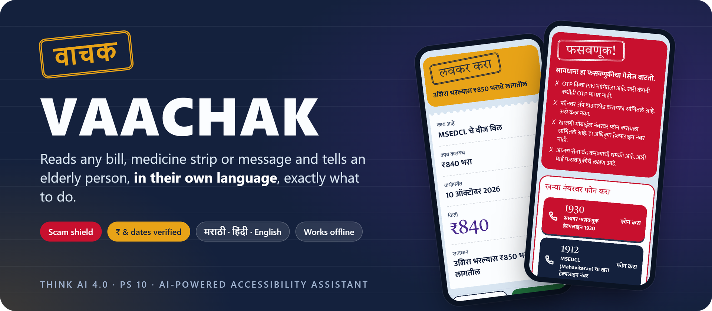</a>
</p>

<p align="center">
  <a href="https://github.com/anveshchafle-cmd/vaachak/actions/workflows/test.yml"></a>
  <a href="https://vaachak-zeta.vercel.app"></a>
  <a href="LICENSE"></a>
  
  
  
</p>

<p align="center">
  <b><a href="https://vaachak-zeta.vercel.app">Live app</a></b> ·
  <b><a href="#-try-it-in-60-seconds">Try it in 60 s</a></b> ·
  <b><a href="https://vaachak-zeta.vercel.app/Vaachak-THINK-AI-4.0.pdf">Pitch deck</a></b> ·
  <b><a href="docs/API.md">API docs</a></b>
</p>

<br>

<table>
<tr>
<td width="44%" align="center" valign="top">
  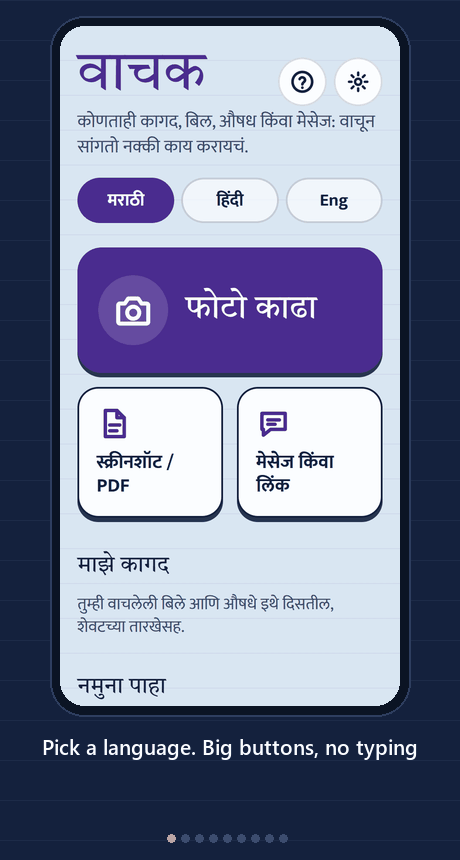
</td>
<td width="56%" valign="top">

### Gemini answers questions. Vaachak never needs one.

**Prakash-kaka, 68, Thane.** Cataract; reads only Marathi. His electricity bill, a new medicine strip and bank SMSes arrive in English jargon and small print while his children are at work. Google Lens can read the text aloud, if he knows what to ask.

Vaachak gives the answer first. Point the camera, upload a PDF, paste an SMS or share a link, and it speaks one **action card** in Marathi, Hindi or English:

> **What is this** · **What to do** · **By when** · **How much** · **Warning**

Every rupee and date is **checked against the print by rules, not AI**. Scams get a red card and one tap to **1930**. When unsure, it says *"हे साफ दिसत नाही, कृपया कुणालातरी विचारा"* (this is not clear, please ask someone).

<table>
<tr>
<td align="center"><b>149 M</b><br><sub>Indians aged 60+</sub></td>
<td align="center"><b>68%</b><br><sub>of women 60–75 cannot read</sub></td>
<td align="center"><b>₹22,495 Cr</b><br><sub>lost to cyber fraud, 2025</sub></td>
</tr>
</table>

</td>
</tr>
</table>

## ✨ Highlights

<table>
<tr>
<td width="33%" valign="top"><br><b>Reads anything</b><br>Voice-guided camera that turns on the torch and shoots by itself, screenshots, PDFs, links, pasted SMS, voice questions.</td>
<td width="33%" valign="top"><br><b>Never guesses</b><br>₹ and dates must appear in the print; on-device OCR must agree. Unverified amount means the Pay button is hidden.</td>
<td width="33%" valign="top"><br><b>Scam shield for India</b><br>Rule-based score for OTP asks, AnyDesk, personal numbers, "cut today" threats, KYC traps, personal UPI, prizes.</td>
</tr>
<tr>
<td valign="top"><br><b>Acts in one tap</b><br>Pay a verified biller, call 1930 or the real helpline, send "Should I pay? YES / NO" to family on WhatsApp.</td>
<td valign="top"><br><b>Remembers for you</b><br>Every dose of every medicine for the whole course in the calendar; <i>My papers</i> shows what is due next.</td>
<td valign="top"><br><b>Natural Indian voice</b><br>Sarvam AI Bulbul v3, slow and clear; first words in about 1.5 s; amounts said in digits and words.</td>
</tr>
<tr>
<td valign="top"><br><b>Works offline</b><br>The same rule engine, Tesseract OCR and a 50-medicine directory run in the browser with no network.</td>
<td valign="top"><br><b>Built for low vision</b><br>Giant text, colour verdicts, pill pictures ☀ 🌤 🌙, danger vibration, a spoken tour in 3 languages.</td>
<td valign="top"><br><b>Private by default</b><br>The server stores nothing. Papers, bill history and settings stay on the phone.</td>
</tr>
</table>

## 🚀 Try it in 60 seconds

1. Open **[vaachak-zeta.vercel.app](https://vaachak-zeta.vercel.app)** on a phone and pick मराठी, हिंदी or English. Tap **?** for a spoken tour.
2. Open a ready-made example. These work even with Wi-Fi off:

   | [🚨 Scam SMS](https://vaachak-zeta.vercel.app/?sample=scam-sms) | [⚡ Electricity bill](https://vaachak-zeta.vercel.app/?sample=electricity-bill) | [💊 Prescription](https://vaachak-zeta.vercel.app/?sample=prescription) | [⛔ Expired medicine](https://vaachak-zeta.vercel.app/?sample=medicine-expired) |
   |:---:|:---:|:---:|:---:|

3. Tap **Message or link** and paste this, then listen:
   ```text
   Dear Consumer, your electricity power will be disconnected tonight at 9.30 pm because your previous month bill was not updated. Please immediately contact our electricity officer 9876543210. Thank you
   ```
4. On any card, tap the mic and ask *"किती पैसे भरायचे?"* ("how much do I pay?"). Questions about anything else are politely refused.

## 🧠 How it works

**AI reads, rules decide.** Gemini is the only step that can guess. Everything after it is a deterministic, tested rule, and the same rule engine is bundled into the phone.

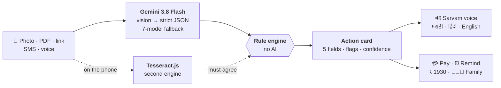

| Check | Rule |
|---|---|
| **Amount** | Must appear in the document text (Indian grouping and Devanagari digits handled), else confidence ≤ 0.5 and Pay is hidden |
| **Date** | Must appear in any common Indian format: `15/10/2026`, `15 Oct 2026`, `Oct 15, 2026` … |
| **Second engine** | Gemini vs on-device OCR; one wrong digit still counts as agreement |
| **Scam score** | OTP/PIN +3 · AnyDesk/APK +3 · personal mobile +2 · "cut today" +2 · personal UPI +2 · prize +2 · odd link +1–2 · KYC +1 → **≥ 3 is a scam** |
| **Expiry** | `EXP 08/2026`, `Exp AUG 2026`, `USE BEFORE 07/27` → red EXPIRED card |
| **Urgency · spike** | ≤ 3 days left → URGENT · bill ≥ 2× the last one → "ask someone before paying" |
| **Prescriptions** | `1-0-1 after food` → ☀ 1 · 🌤 0 · 🌙 1; every medicine kept as its own schedule |

## 📊 Measured, not claimed

Timed on the live app, 8 October 2026.

| Flow | Time | Checked |
|---|:---:|---|
| Pasted SMS → spoken card | **1.6–2.6 s** | 4 / 4 test scams caught · 0 real bank or government SMS flagged |
| Bill photo → verified card | **3.7–5.0 s** | ₹ and date found in the printed text |
| Voice starts speaking | **1.5–2.2 s** | first sentence first, MP3 |
| Voice question → answer | **1.3–3.0 s** | answers only from the document |
| Rule engine | **58 tests** | run on every push by GitHub Actions |

<details>
<summary><b>📱 Screens</b></summary>
<br>

| Scam caught | Call the real number | Bill verified | Three medicines |
|:---:|:---:|:---:|:---:|
| 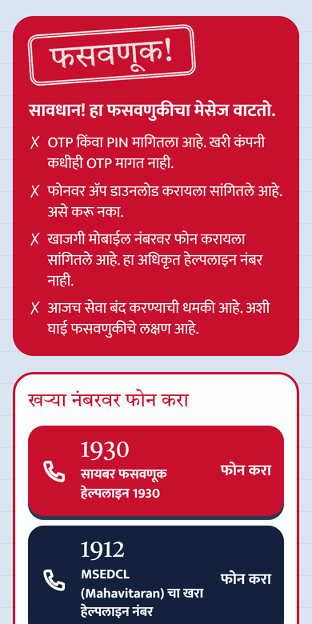 | 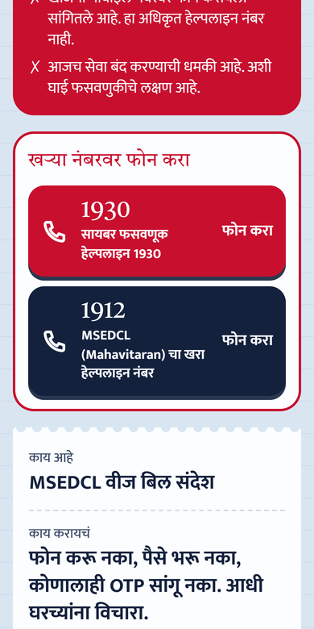 | 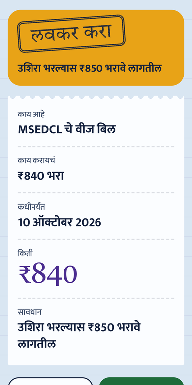 | 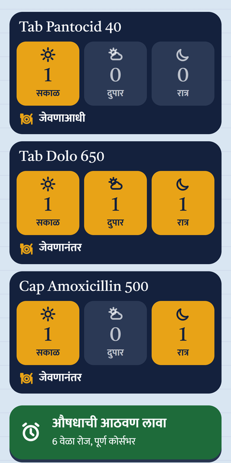 |
| **Whole-course reminders** | **My papers** | **Home** | **Spoken tour** |
| 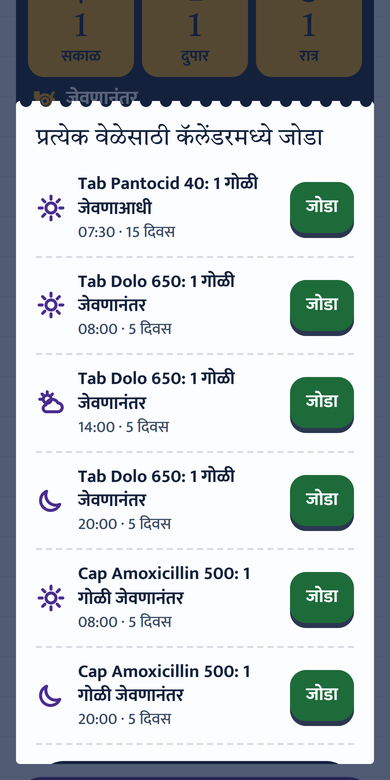 | 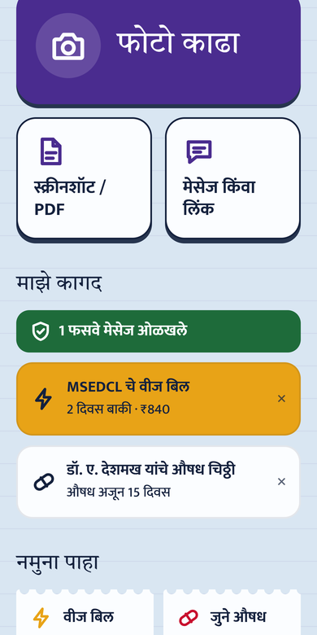 | 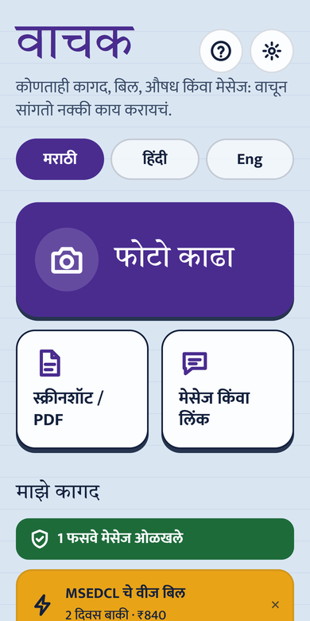 | 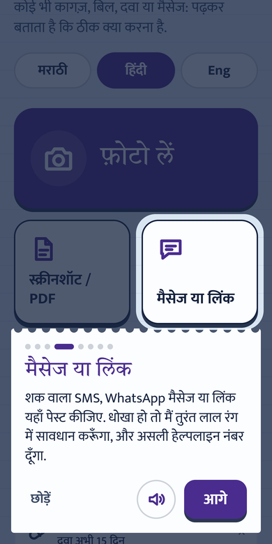 |

</details>

## 🧰 Tech stack

<p>
  
  
  
  
  
  
  
  
  
</p>

| Layer | What it does |
|---|---|
| **Reading** | Gemini 3.8 Flash reads photos, PDFs and text into a strict JSON card; falls back across 7 models when busy |
| **Safety** | Plain-JavaScript rule engine shared by server and browser; Tesseract.js as a second, on-device engine |
| **Voice** | Sarvam AI Bulbul v3 for natural Indian speech; Gemini TTS backup; recorded Marathi and Hindi clips offline |
| **App** | React 19 PWA: installable, share target, camera torch, vibration, offline cache |
| **Backend** | Node.js serverless functions on Vercel, Mumbai region, zero npm dependencies |

## 🛠️ Getting started

**Requirements:** Node.js 22 · a free [Gemini API key](https://aistudio.google.com/apikey) · optionally a [Sarvam AI](https://dashboard.sarvam.ai) key for the Indian voice

```bash
git clone https://github.com/anveshchafle-cmd/vaachak.git
cd vaachak
cp .env.example .env            # add GEMINI_API_KEY (and SARVAM_API_KEY)

npm test                        # 58 tests, no key needed
npm run dev                     # API on http://localhost:3000

cd frontend && npm install
VITE_PROXY=http://localhost:3000 npm run dev    # app on http://localhost:5173
```

<details>
<summary><b>Environment variables</b></summary>
<br>

| Variable | Required | Purpose |
|---|:---:|---|
| `GEMINI_API_KEY` | ✅ | Reading documents and answering questions |
| `SARVAM_API_KEY` | | Natural Indian voice (falls back to Gemini TTS) |
| `GEMINI_MODEL` | | Override the main model (default `gemini-3.8-flash`) |
| `GEMINI_FALLBACK_MODELS` | | Comma-separated backup models |
| `SARVAM_SPEAKER`, `SARVAM_PACE` | | Voice and speed (default `shubh`, `0.85`) |

</details>

<details>
<summary><b>Useful scripts</b></summary>
<br>

```bash
npm run try -- "path/to/bill.jpg" mr     # read a real photo, print the card
npm run samples -- 2026-10-09            # rebuild demo cards (mr, hi, en) for a given day
npm run audio                            # record the offline warning clips
```

</details>

<details>
<summary><b>Deploy to Vercel</b></summary>
<br>

Import the repo in Vercel, add `GEMINI_API_KEY` (and `SARVAM_API_KEY`) as environment variables, and deploy. [`vercel.json`](vercel.json) builds the frontend and serves the API from the same URL in the Mumbai region.

</details>

<details>
<summary><b>Project structure</b></summary>
<br>

```
api/              Serverless endpoints: read, ask (voice Q&A), tts, reminders (.ics), health
lib/              The engine, shared by server and browser
  card.js           builds the action card and applies every rule
  rules.js          amount/date checks, expiry, dose patterns, bill spike
  scam.js           weighted scam signals for Indian frauds
  consensus.js      Gemini vs on-device OCR agreement
  helplines.js      1930 and real company helplines
  reminders.js      dose schedules → calendar events
  offline.js        the whole card built on the phone with no network
  prompts.js        Gemini extraction schema and prompts
  gemini.js         model calls with fallback and cooldowns
  speech.js         Sarvam voice with Gemini backup
frontend/src/     React app: Home, Camera, Reading, Card, Tour, My papers
samples/          Ready-made cards in Marathi, Hindi and English
test/             node:test suites and fixtures
docs/             API contract, screenshots, assets
```

The full request and response format is in **[docs/API.md](docs/API.md)**.

</details>

## 🗺️ Roadmap

- [x] Bills, medicines, prescriptions, notices, SMS and links → spoken action card
- [x] Rule-based verification, scam shield, expiry and bill-spike checks
- [x] Marathi, Hindi and English · offline mode · spoken tour
- [x] One-tap 1930, whole-course reminders, My papers, Jan Aushadhi tip
- [ ] All 22 scheduled Indian languages via Sarvam / Bhashini
- [ ] WhatsApp bot: forward any document to Vaachak
- [ ] Family app with alerts for due bills and caught scams
- [ ] BBPS payments with verified billers
- [ ] Fully offline on-device model

## 👥 Team

<table>
<tr>
<td align="center" width="25%"><br><b>Anvesh Chafle</b><br><sub>Backend, AI pipeline & safety rules</sub></td>
<td align="center" width="25%"><br><b>Maulik Parshionikar</b><br><sub>Frontend, UI/UX & accessibility</sub></td>
<td align="center" width="25%"><br><b>Nimisha Jain</b><br><sub>Presenter · research & live demo</sub></td>
<td align="center" width="25%"><br><b>Jiya Khut</b><br><sub>Presenter · pitch & user testing</sub></td>
</tr>
</table>

Built for **THINK AI 4.0** at IETE TCET Mumbai · problem statement **PS 10: AI-Powered Accessibility Assistant**.

## 📚 Sources

UNFPA *India Ageing Report 2023* · *National Blindness & Visual Impairment Survey 2015–19* · Indian Cybercrime Coordination Centre (I4C) data, via Moneylife (2025).

## 📄 License

[MIT](LICENSE) © 2026 Team Vaachak
